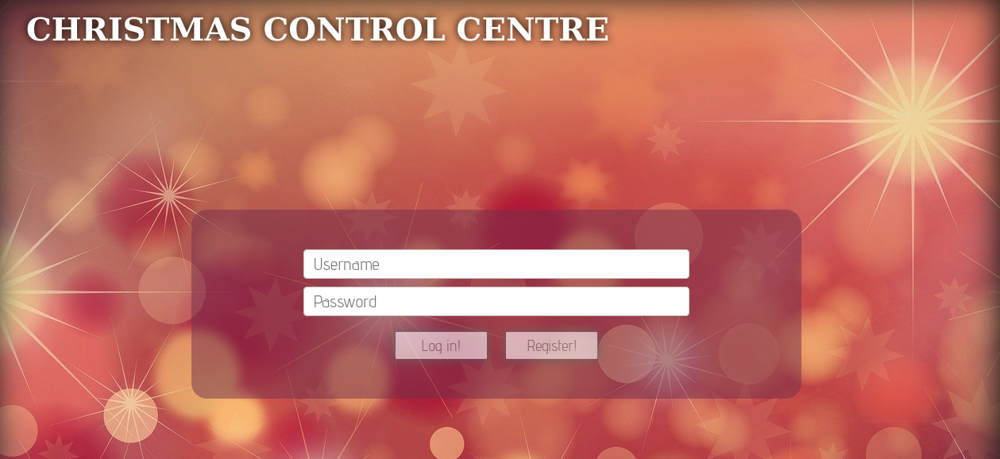
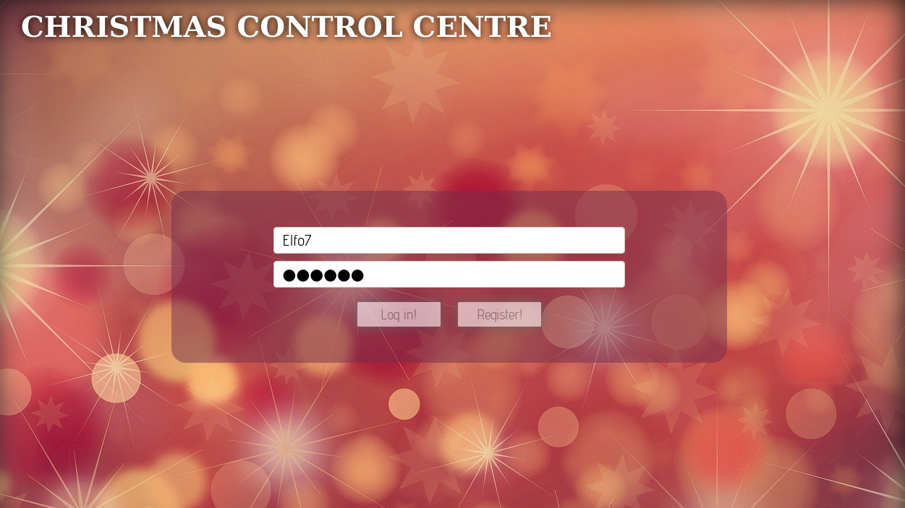
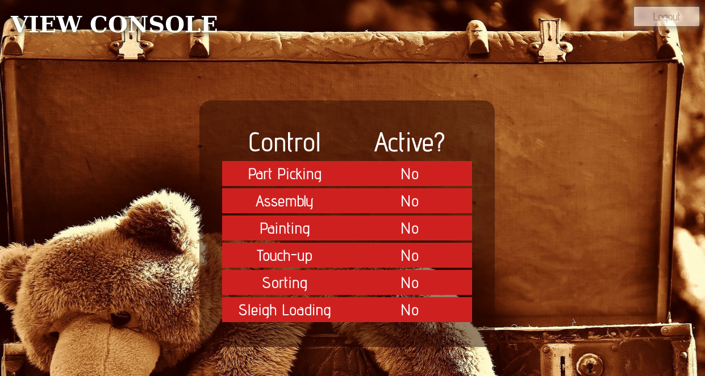
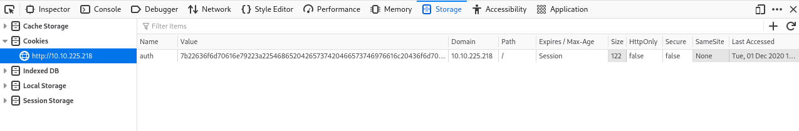
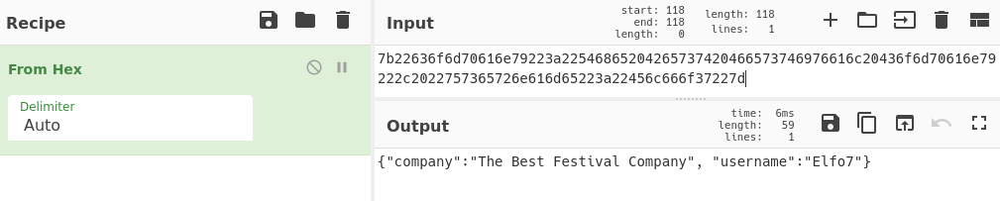
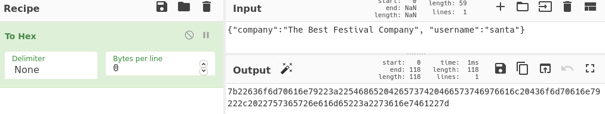
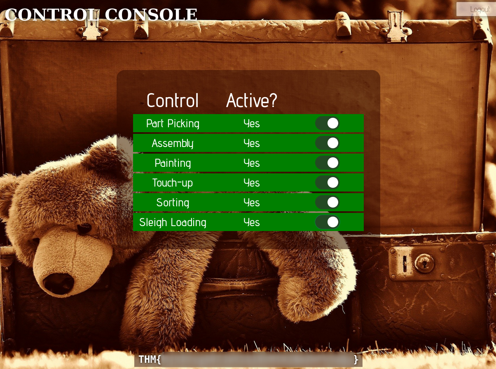

# [Day 1] `Web Exploitation` A Christmas Crisis

Deploy the box and open the IP Address of it in the browser

We are presented with a register/ login form.

Register a new user:
I am gonna create one with the username: `Elfo7` and password: `foobar`

Afterwards we can login with our username and password

All controls are inactive... Let's do something about that.

Open up the Developer Tools, press `F12` or `Ctrl+Shift+I` and navigate to the
`storage` tab (Application tab in Chrome/Edge).
We can see a cookie with the name of `auth` and a base16 aka hex encoded value.

Copy the value of the auth cookie and paste it into the input field on [CyberChef FromHex](https://gchq.github.io/CyberChef/#recipe=From_Hex('Auto'))
The output will be json object.

We can now copy the json object and copy it into the input field on [CyberChef ToHex](https://gchq.github.io/CyberChef/#recipe=To_Hex('None',0))
and change the username to 'santa'. CyberChef will encode the json into hex for us.

Copy the hex string and replace the value of the auth cookie with it and reload the page.
Finally we are able to active all the controls and capture the THM-flag

